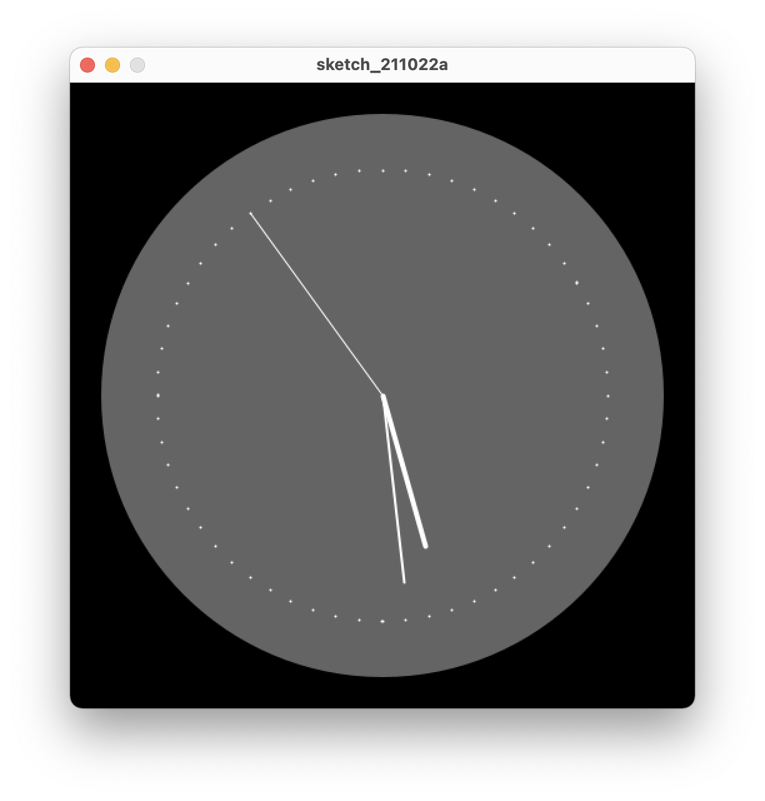

# Clock

## What to do?
* The goal of the program is to write the code to display a clock.

### Approach
* The Diagram is at the centre so circle center should be at the center of the canvas.
* Initial setup should have background and initial value of second, minute and hour radius.
* Time should be constantly updating so it goes into draw() function and every time the clock fill removes the previour draw() result.
* Time is updated using second(), minute() and hour() functions.

### Code Output
