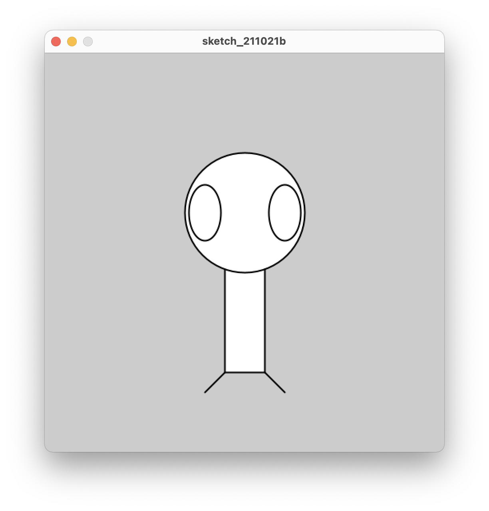

# Draw Figure

## What to do?
* The goal of the program is to write the code to get this diagram.

### Approach
* The Diagram is at the centre so circle center should be at the center of the canvas.
* rectangle should come first as it is at the back of circle.
* legs in the figure start from the rectangle vertices and have 45degree angle.
* Eyes have small width and large height.

### Code Output
