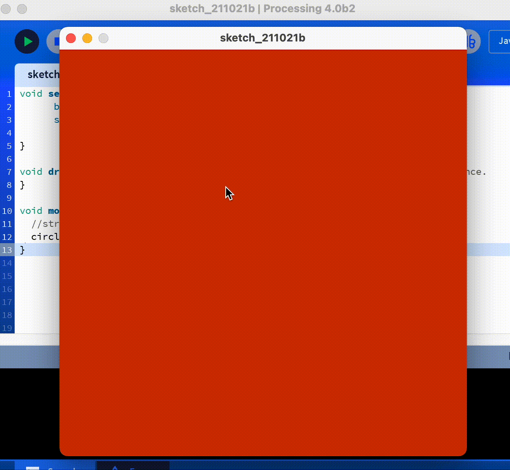

# Mouse Click Draw Circle

## What to do?
* The goal of the program is to write the code to get get a circle on the screen when mouse is clicked with the mouse coordinates as the center of the circle.

## Output
___

### Approach
* Use mouseClicked() function to add a event listner for mouse click.
* circle(x,y,extent) to draw a circle.
* mouseX and mouseY to get the x and y coordinates of circle.