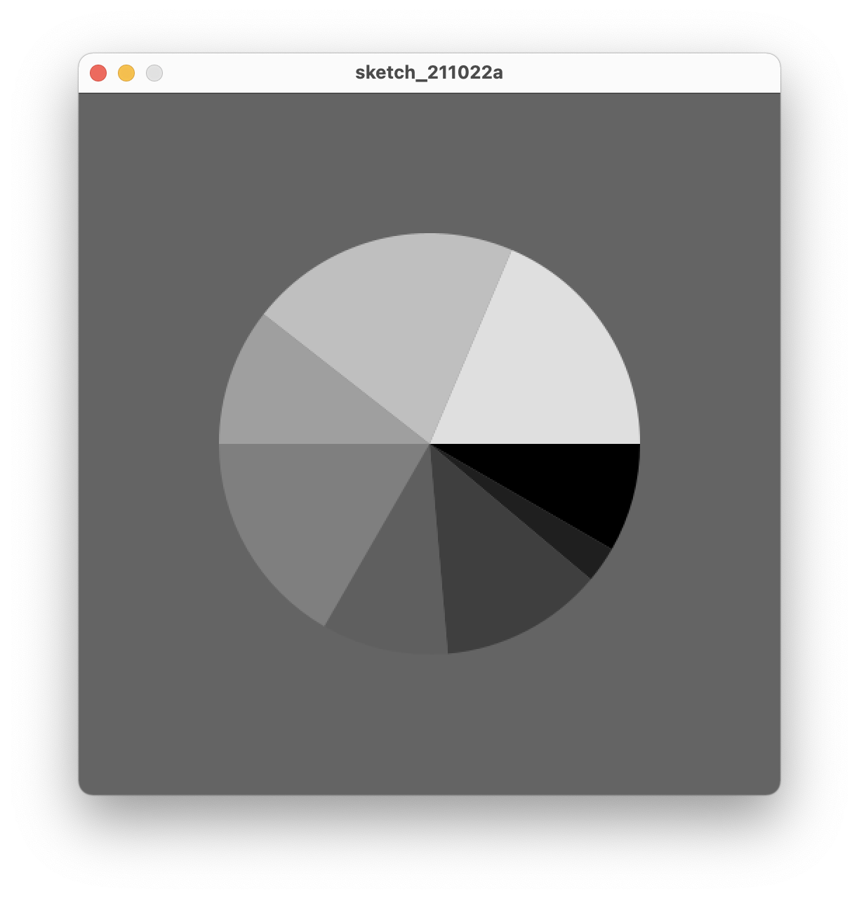

# Pie Chart

## What to do?
* The goal of the program is to write the code to get this pie chart.

### Approach
* The Diagram is at the centre, so circle center should be at the center of the canvas.
* Angles are taken to approximate the angles in the figure.
* Loop is not required for this problem statement.
* Colors of each arc are form black(255) to white(0), which can be mapped by index in the color range.
* Arc can be used to draw each part of the pie chart.

### Code Output
